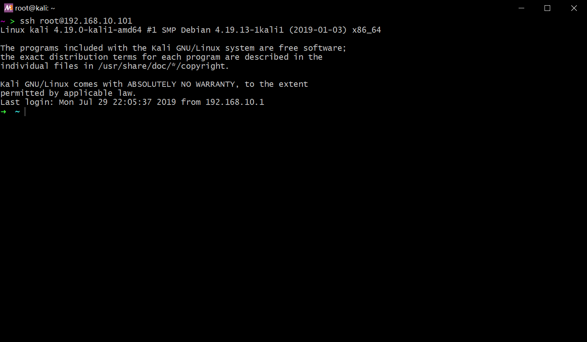
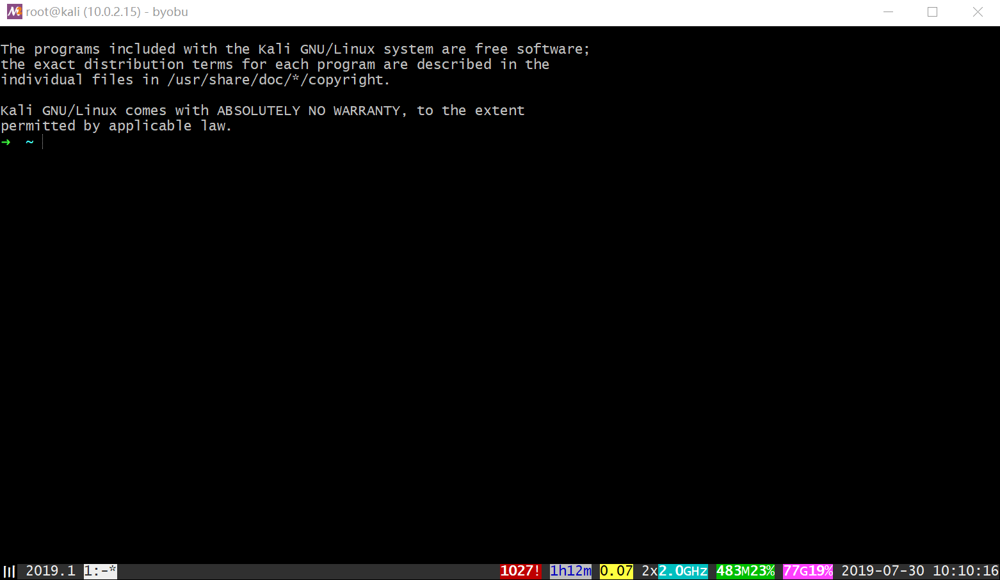
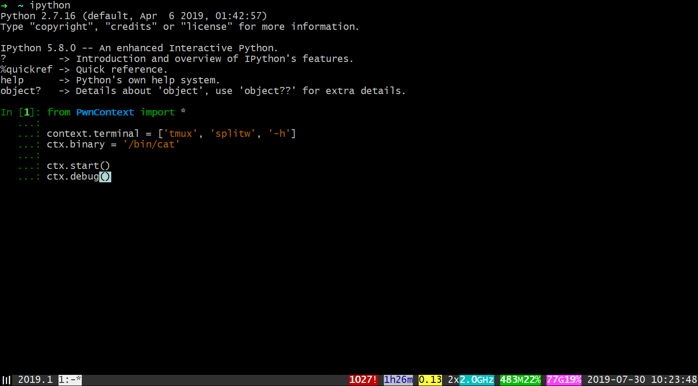
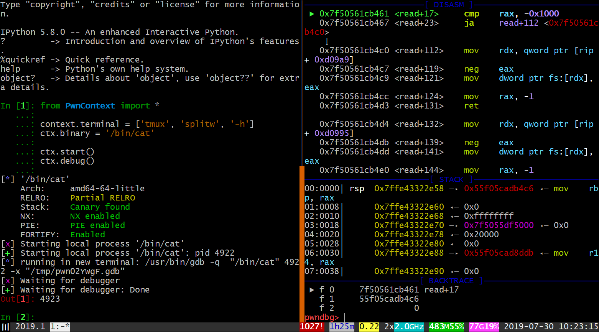
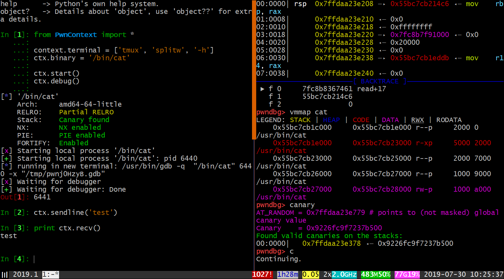

# pre-requirement

- linux
    - recommend `ubuntu` and `kali`.
    - ssh service need to be open for virtual machine.
- editor
    - editor on your host system.
        - recommend `notepad++` for windows.
    - alternatively, terminal editor like `vim`.
- terminal
    - terminal on your host system.
        - recommend `msys2` for windows.
    - tmux on linux
        - recommend `byobu`. ( a wrapper of tmux )
- pwn
    - pwntools
    - pwndbg
    - IPython
    - [welpwn](https://github.com/matrix1001/welpwn)
    - [glibc-all-in-one](https://github.com/matrix1001/glibc-all-in-one)


# step 1

if you use linux as your host system, you can ignore this step.

use the terminal on your host system, and ssh into your virtual machine.



# step 2

open tmux. I use `byobu` personally.



# step 3

open your editor, and write some script.

use this for test. ( assume that you have installed `welpwn` )

```python
from PwnContext import *

context.terminal = ['tmux', 'splitw', '-h']
ctx.binary = '/bin/cat'

ctx.start()
ctx.debug()
```

# step 4

open `IPython` in your terminal, and copy the code in your editor. then paste into `IPython`.



press enter to exec the code.



look what we got ! IPython shell on the left and gdb on the right.

# step 5

do what you need in gdb and do IO in IPython.



# conclusion

this is just a simple tutorial about the basic pwn environment.

you may not realize how convenient it is.

keep learning rest sections and you will know it.